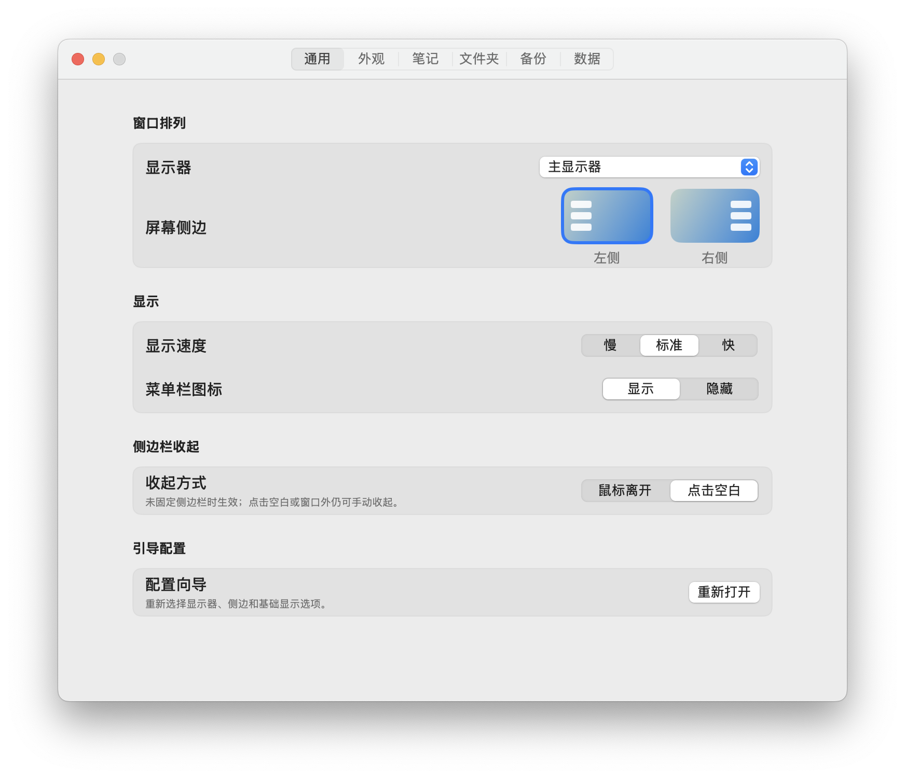
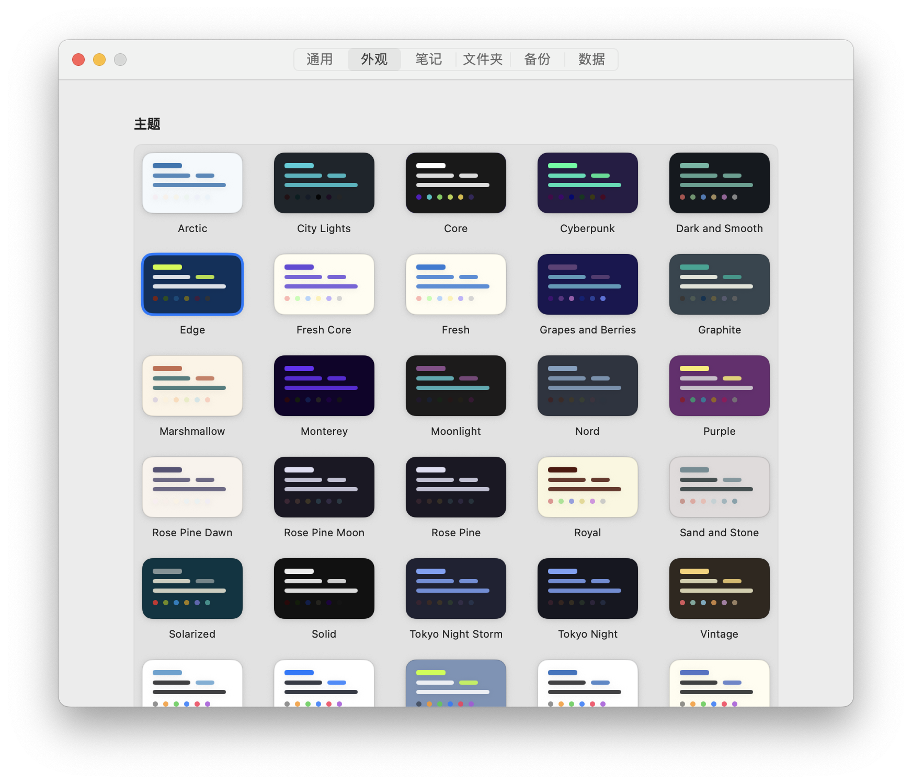
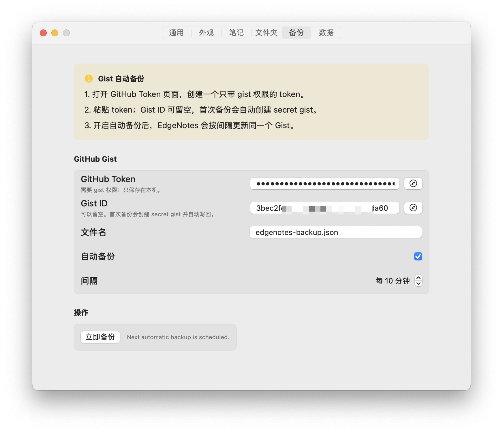
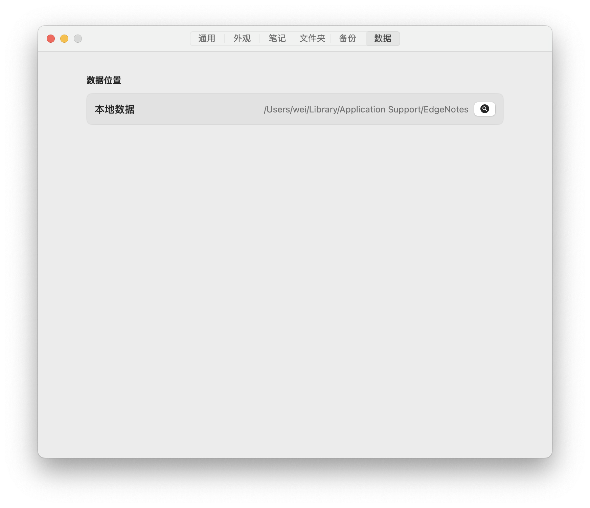

# EdgeNotes

<p align="center">
  
</p>

<p align="center">
  <strong>贴在屏幕边缘的 macOS 笔记面板。</strong>
</p>

<p align="center">
  <a href="https://github.com/minivv/EdgeNotes/releases/latest">
    
  </a>
  <a href="https://github.com/minivv/EdgeNotes/blob/main/LICENSE">
    
  </a>
  
  
</p>

EdgeNotes 是一个轻量的 macOS 侧边笔记工具。它常驻在屏幕左侧或右侧，需要时把鼠标移到边缘即可唤出，用文件夹和卡片管理零散想法、任务和临时记录。

## 特性

- **边缘唤出**：将面板固定到屏幕左侧或右侧，靠近屏幕边缘即可快速打开。
- **文件夹与卡片**：支持文件夹、笔记卡片、置顶、折叠、拖动排序和颜色标记。
- **边写边排版**：支持常用 Markdown 写作体验，包括标题、加粗、斜体、列表、引用和任务列表。
- **主题系统**：内置多套 `.edgetheme` 主题，随应用一起打包。
- **本地优先**：笔记数据保存在本机，可选 GitHub Gist 自动备份。
- **简洁菜单栏**：菜单栏只保留显示侧边栏、设置和退出。







## 下载

前往 [Releases](https://github.com/minivv/EdgeNotes/releases/latest) 下载最新版：

- `EdgeNotes-macOS.zip`

解压后将 `EdgeNotes.app` 移动到 `/Applications` 即可使用。

> 目前 release 版本使用本地签名，尚未做 Apple notarization。首次启动时，macOS 可能需要在 Finder 中右键应用并选择“打开”。

## 从源码构建

环境要求：

- macOS 14 或更新版本
- Xcode Command Line Tools
- Swift 5.10 或更新版本

构建并运行校验：

```bash
swift build
script/build_and_run.sh --verify
```

生成可发布的 zip：

```bash
script/package_release.sh
```

产物会生成在：

```text
dist/EdgeNotes-macOS.zip
```

## 主题

主题文件位于 `themes/*.edgetheme`，构建时会直接复制进应用包：

```text
EdgeNotes.app/Contents/Resources/themes/
```

因此 `themes/` 是运行资源目录，不是参考素材目录。删除或忽略它会导致发布包缺少完整主题。

## 备份

EdgeNotes 可以使用 GitHub Gist 做自动备份。你可以在引导流程或设置中填入拥有 `gist` 权限的 GitHub token；Gist ID 可以留空，首次备份时会自动创建。

## 命令行工具

EdgeNotes 内置 `edgenotes` CLI，但默认不会启用。打开“设置 → 命令行”，点击“安装命令行工具”后，会在以下位置创建符号链接并启动仅限当前用户访问的本地服务：

```text
~/.local/bin/edgenotes
```

如果 `~/.local/bin` 尚未加入终端的 `PATH`，请将下面一行加入 `~/.zshrc`：

```bash
export PATH="$HOME/.local/bin:$PATH"
```

CLI 提供分层帮助和 JSON 输出，适合终端操作、Alfred、自动化脚本与 AI 工具调用：

```bash
edgenotes --help
edgenotes notes --help
edgenotes notes list --json
edgenotes notes create --title "随手记" --body "稍后整理"
edgenotes notes create --title "项目记录" --folder "工作"
edgenotes notes update "随手记" --body "新的内容"
edgenotes notes append "随手记" --text "继续补充"
edgenotes notes update "随手记" --folder "工作"
```

CLI 不会直接修改 `notes.json`；所有读写都经由 EdgeNotes 应用执行。可随时在同一设置页面卸载命令行工具并关闭服务。
未指定 `--folder` 创建笔记时，会自动创建或复用侧边栏中的“新建文件夹”；脚本需要固定目标时可以显式传入文件夹名称或 UUID。
对于创建和更新命令，指定的文件夹名称不存在时会自动创建；文件夹 UUID 则必须已经存在。
读取或修改笔记时可以使用 UUID 或完整标题；如果存在重名笔记，CLI 会提示改用 UUID。

## 许可证

EdgeNotes 基于 [MIT License](LICENSE) 开源。
